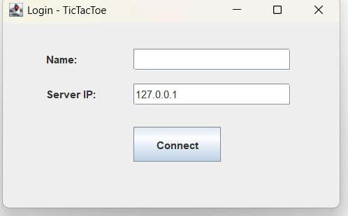
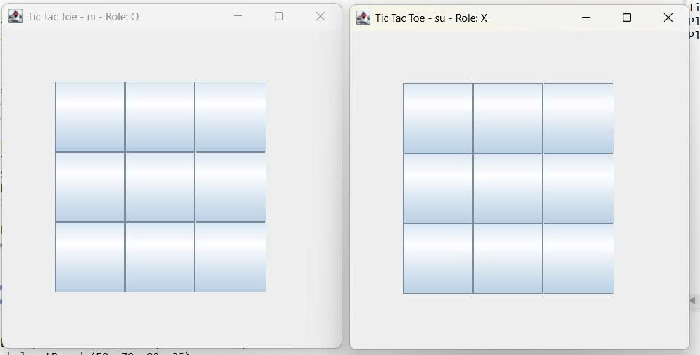
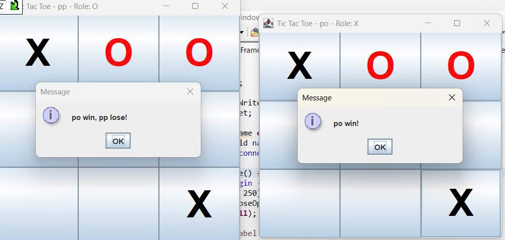
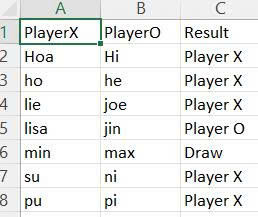

<h2 align="center">
    <a href="https://dainam.edu.vn/vi/khoa-cong-nghe-thong-tin">
    🎓 Faculty of Information Technology (DaiNam University)
    </a>
</h2>
<h2 align="center">
   GAME TIC TAC TOE (CARO 3x3)
</h2>

    

        
        
        
    

## 1. Giới thiệu hệ thống

Hệ thống Game Tic Tac Toe được phát triển theo mô hình Client – Server:

- Client: ứng dụng giao diện đồ họa bằng Java Swing để người chơi thao tác.
- Server: quản lý kết nối, ghép cặp người chơi, xử lý luật chơi và lưu trữ lịch sử trận đấu.

** Chức năng chính **
- Đăng nhập/nhập tên để tham gia hệ thống.
- Ghép cặp tự động giữa hai người chơi.
- Chơi Tic Tac Toe online với luật chuẩn (X/O, thắng, thua, hòa).
- Xử lý tình huống thoát giữa chừng (người còn lại thắng).
- Lưu lịch sử trận đấu (người lại.
## 2. Công nghệ sử dụng
Ngôn ngữ lập trình: Java (JDK 8+).
Giao diện người dùng: Java Swing (JFrame, JButton, JLabel, JPanel).
Truyền thông mạng: TCP Socket.
Lưu trữ dữ liệu: File CSV (matches.csv). Có thể mở rộng sang SQLite/JDBC.
Kiến trúc:
Client: Swing + lớp NetworkClient quản lý socket.
Server: ServerMain + ClientHandler + GameRoom + Storage. ## 3. Hình ảnh các chức năng
Màn hình đăng nhập/kết nối
Nhập Server, Port, Tên người chơi.
Nút Kết nối & Chơi.
Màn hình chơi game
Bàn cờ 3x3 bằng các nút bấm.
Hiển thị lượt chơi.
Khi có kết quả, hệ thống thông báo thắng/thua/hòa.
Thông báo kết quả
Cửa sổ popup hiển thị kết quả trận đấu.
File lưu trữ (matches.csv)
Lưu: thời gian, roomId, playerX, playerO, kết quả, bàn cờ cuối cùng.

## 3. Hình ảnh các chức năng
- Màn hình đăng nhập/kết nối
    - Nhập Server, Port, Tên người chơi.
    - Nút Kết nối & Chơi.
      

  

  <em> Hình 1: Nhập tên sau khi chạy client </em>

- Màn hình chơi game
    - Bàn cờ 3x3 bằng các nút bấm.
    - Hiển thị lượt chơi.
    - Khi có kết quả, hệ thống thông báo thắng/thua/hòa.
      

  

  <em> Hình 2: Nhập tên sau khi chạy client </em>

- Thông báo kết quả
    - Cửa sổ popup hiển thị kết quả trận đấu.
      

  

  <em> Hình 3: Nhập tên sau khi chạy client </em>

- File lưu trữ (matches.csv)
    - Lưu: thời gian, roomId, playerX, playerO, kết quả, bàn cờ cuối cùng.
    

  

  <em> Hình 4: Lịch sử đấu </em>

## 4. Cài đặt & chạy chương trình
- Bước 1: Chuẩn bị môi trường
Cài đặt Java JDK 8+.
Kiểm tra bằng: java -version

- Bước 2: Biên dịch chương trình
javac server/*.java
javac client/*.java

- Bước 3: Khởi chạy Server
java server.ServerMain

- Bước 4: Khởi chạy Client
Mở 2 terminal khác nhau để mô phỏng 2 người chơi, mỗi bên chạy:
java client.LoginFrame
Nhập 127.0.0.1, 5000, và tên người chơi khác nhau.

- Bước 5: Chơi game
Hai client kết nối thành công sẽ được ghép cặp.
Người chơi lần lượt đánh X/O trên giao diện.
Khi kết thúc, kết quả hiển thị và lưu lại lịch sử đấu.

## Thông tin liên hệ  
Họ tên: Nguyễn Thị Kiều Hoa.  
Lớp: CNTT 16-03.  
Email: ngochoa061204@gmail.com.

© 2025 AIoTLab, Faculty of Information Technology, DaiNam University. All rights reserved.

---

