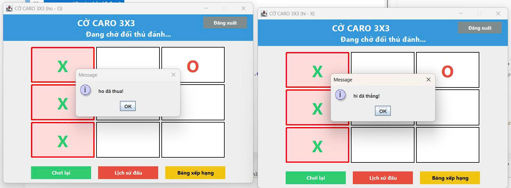
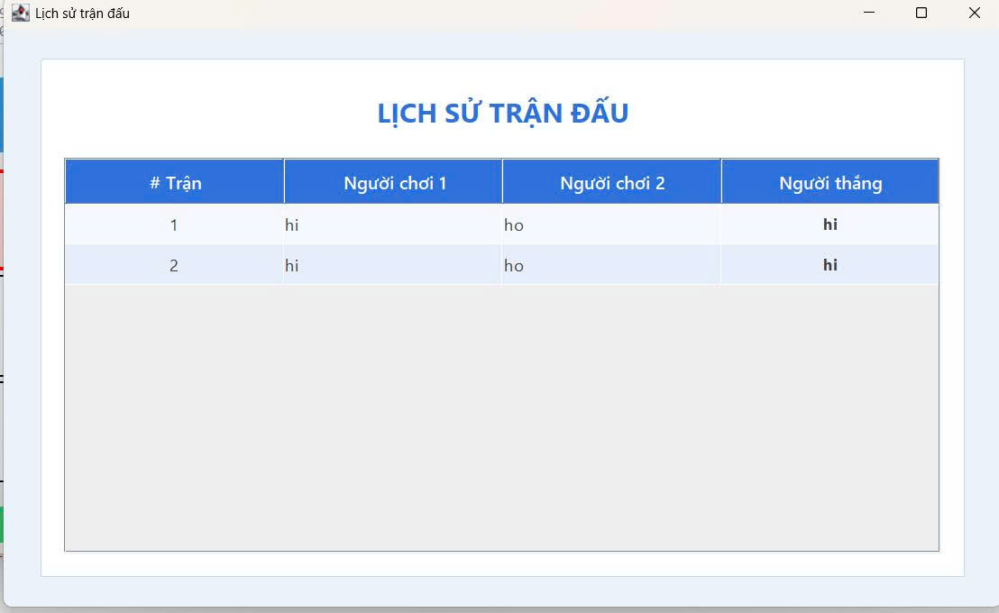
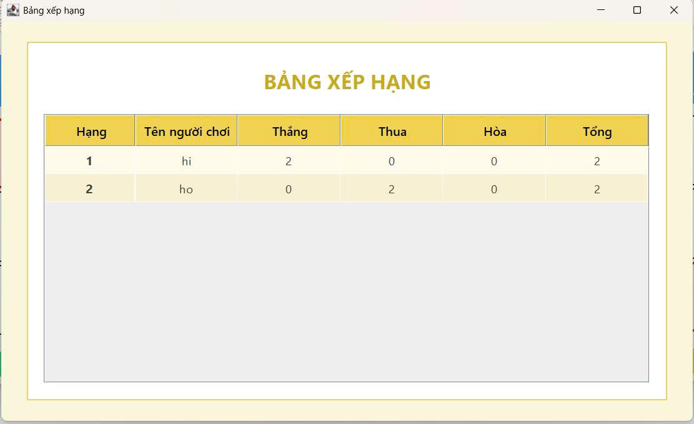

<h2 align="center">
    <a href="https://dainam.edu.vn/vi/khoa-cong-nghe-thong-tin">
    🎓 Faculty of Information Technology (DaiNam University)
    </a>
</h2>
<h2 align="center">
   GAME TIC TAC TOE (CARO 3x3)
</h2>

    

        
        
        
    

## 1. Giới thiệu hệ thống

Ứng dụng Tic Tac Toe 3x3 được xây dựng theo mô hình Client–Server, sử dụng giao thức TCP để kết nối người chơi và đồng bộ ván đấu theo thời gian thực.
Hệ thống hỗ trợ đăng ký, đăng nhập, ghép cặp tự động, thi đấu online, ghi nhận lịch sử trận đấu và hiển thị bảng xếp hạng.

** Chức năng chính **

🟦 Đăng ký tài khoản

- Tạo username + password mới.

- Kiểm tra trùng lặp username.

- Lưu thông tin vào file accounts.txt.

🟦 Đăng nhập hệ thống

- Kiểm tra tài khoản từ server.

- Tự động đưa người chơi vào hàng chờ để ghép cặp.

🟦 Ghép cặp tự động

- Server luôn theo dõi danh sách người chơi đang chờ.

- Khi đủ 2 người → tạo phòng GameRoom mới và bắt đầu ván đấu.

🟦 Chơi Tic Tac Toe online

- Hai người chơi tương ứng quân X và O.

- Giao thức TCP đảm bảo đồng bộ:

    - Nước đi hợp lệ

    - Lượt chơi

    - Kết quả trận đấu

    - Trạng thái bảng cờ

🟦 Bộ đếm thời gian 30 giây mỗi lượt

- Nếu hết thời gian → mất lượt → server điều khiển phiên tiếp theo.

🟦 Lưu lịch sử & kết quả

- Mỗi trận đấu được ghi lại: người chơi 1, người chơi 2, người thắng.

- Hiển thị lịch sử khi người chơi yêu cầu.

🟦 Bảng xếp hạng

- Sắp xếp theo số trận thắng giảm dần.

- Thống kê đầy đủ: thắng – thua – hòa – tổng số trận
  
## 2. Công nghệ sử dụng

## 3. Hình ảnh các chức năng

  
 
 <em>Hình 1: Giao diện đăng nhập</em> 

  
 
 <em>Hình 2: Giao diện đăng ký</em> 

  
 
 <em>Hình 3: Giao diện Game Caro 3x3</em> 

  
 
 <em>Hình 4: Giao diện kết thúc game</em> 

  
 
 <em>Hình 5: Giao diện lịch sử đấu</em> 

  
 
 <em>Hình 6: Giao diện bảng xếp hạng</em> 

## 4. Cài đặt & chạy chương trình
🔧 Bước 1: Chuẩn bị môi trường

Cài đặt:

- Java JDK 8 trở lên

- IDE bất kỳ: IntelliJ IDEA, Eclipse, NetBeans

🔧 Bước 2: Tải project

Clone hoặc tải source code:

git clone <repository-url>

🔧 Bước 3: Chạy server

Vào thư mục:

Server/ServerMain.java

Bấm Run, nếu thành công sẽ xuất hiện:

Server started...

🔧 Bước 4: Chạy client

Chạy file:

Client/LoginFrame.java

Mỗi lần chạy = 1 client.
Chạy 2 client để test 2 người chơi.

🔧 Bước 5: Đăng ký ➝ đăng nhập ➝ vào game

1. Đăng ký tài khoản

2. Đăng nhập

3. Tự động ghép cặp với người chơi khác

4. Ván đấu bắt đầu

🔧 Bước 6: Chơi game

- Người chơi “X” luôn đi trước.

- Mỗi lượt có 30 giây.

- Kết thúc bằng:

    - Thắng

    - Thua

    - Hòa

🔧 Bước 7: Xem lịch sử & bảng xếp hạng

Ngay trong GameFrame → chọn:

- “Lịch sử đấu”

- “Bảng xếp hạng”

## Thông tin liên hệ  
Họ tên: Nguyễn Thị Kiều Hoa.  
Lớp: CNTT 16-03.  
Email: ngochoa061204@gmail.com.

© 2025 AIoTLab, Faculty of Information Technology, DaiNam University. All rights reserved.

---

